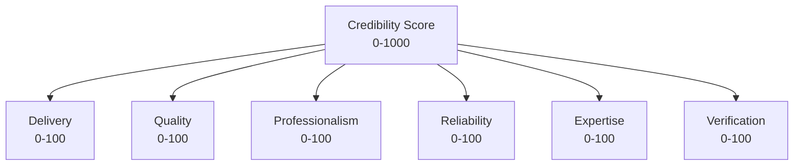
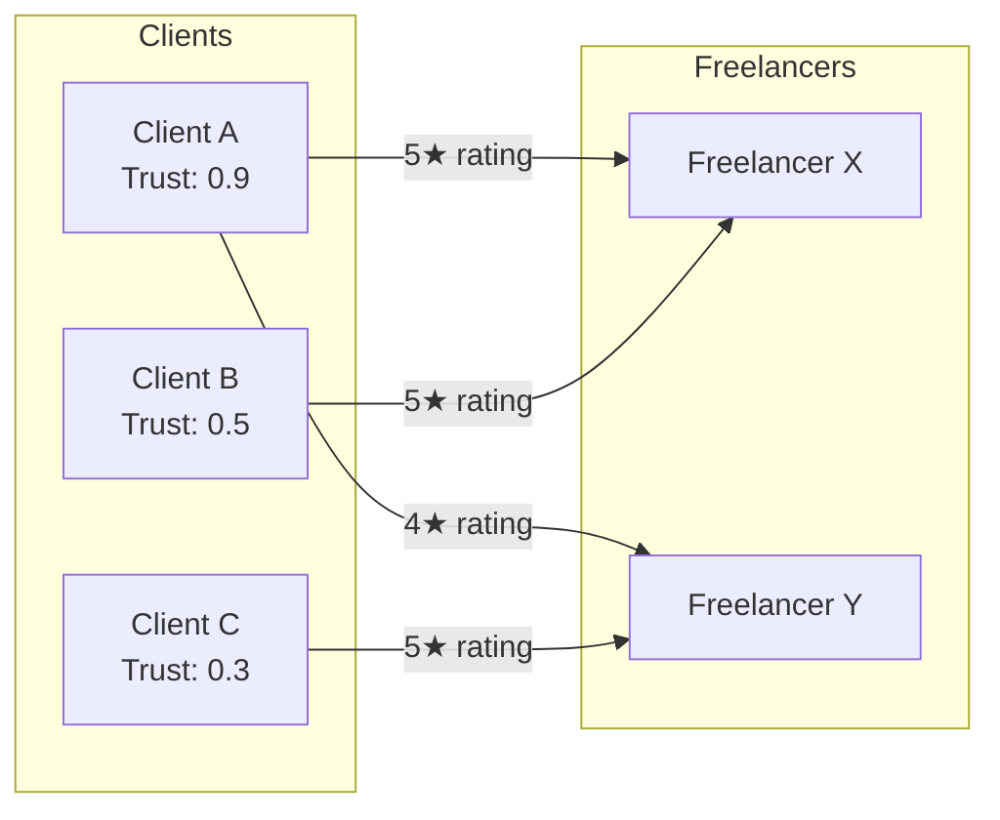

# Defellix Credibility Score — Deep Research & Algorithm Proposals

> **Author perspective**: Senior PM at Google · March 2026
> **Objective**: Design a rock-solid, industry-disrupting credibility scoring system that defines what **trust** means in freelancing.

---

## Part 1 — Current State Analysis

### What We Have Today

The existing [reputation_service.go](file:///home/saiyam/Documents/decentralized_freelancer_trust_platform/backend/services/user-service/internal/service/reputation_service.go) uses a simplistic additive formula:

```
base_score  = client_rating × 10   (range 10–50)
deadline    = +10 if on time
penalty     = revision_count × 5
final       = base_score + deadline − penalty   (floor 0)
aggregate   = SUM of all contract final scores
```

> [!CAUTION]
> **Critical flaws in the current system:**
> 1. **Unbounded cumulative score** — a freelancer with 100 average projects will always outrank one with 5 exceptional projects.
> 2. **No time decay** — work done 3 years ago carries identical weight to work done yesterday.
> 3. **Easily gamed** — create many small contracts with friendly clients → infinite score growth.
> 4. **No cold-start solution** — new freelancers start at 0, which feels punitive and disconnects from profile quality.
> 5. **No client-quality weighting** — a review from a verified Fortune-500 client counts the same as one from a brand-new throwaway account.
> 6. **No deduction for abandonment, ghosting, or contract cancellation.**

### Available Data Signals (from codebase audit)

| Source | Signals |
|--------|---------|
| **User Profile** | `full_name`, `skills`, `experience`, `github_link`, `linkedin_link`, `portfolio_link`, `is_verified`, `is_profile_complete`, `photo`, `bio`, `phone`, `testimonials`, `projects` |
| **Contract** | [status](file:///home/saiyam/Documents/decentralized_freelancer_trust_platform/frontend/src/Pages/MilestoneSubmission.tsx#54-65) (draft→sent→pending→signed→active→completed→cancelled), `is_revised`, `total_amount`, `milestones[]`, `created_at`, `sent_at`, `client_signed_at`, `blockchain_status` |
| **Milestone** | [status](file:///home/saiyam/Documents/decentralized_freelancer_trust_platform/frontend/src/Pages/MilestoneSubmission.tsx#54-65) (pending→submitted→approved→paid→revision), `due_date`, `amount`, `submission_criteria` |
| **Submission** | [status](file:///home/saiyam/Documents/decentralized_freelancer_trust_platform/frontend/src/Pages/MilestoneSubmission.tsx#54-65) (draft→pending_review→accepted→revision_requested→ghosted), `submitted_at`, `reviewed_at`, `revision_history` |
| **Reputation** | `base_rating` (1–5), `deadline_bonus`, `revision_penalty`, `calculated_score`, `client_feedback` |
| **Testimonial** | `rating` (1–10), `comment`, `is_verified`, `client_name`, `client_email` |

---

## Part 2 — Design Principles (Inspired by FICO, PageRank, ELO, Bayesian, Airbnb)

Before presenting the 4 algorithms, here are the non-negotiable design axioms:

| # | Principle | Inspiration |
|---|-----------|-------------|
| 1 | **Bounded range** — score must have a fixed max (e.g. 0–1000) for comparability | FICO (300–850) |
| 2 | **Time decay** — recent work matters more than old work | ELO, Bayesian |
| 3 | **Quality > Quantity** — 5 exceptional projects > 50 mediocre ones | PageRank |
| 4 | **Cold-start fairness** — new users get a non-zero score based on profile signals | FICO "thin file" |
| 5 | **Deductions are real** — score MUST go down for bad behavior | Credit scoring |
| 6 | **Client-quality weighting** — reviews from verified, high-spend clients matter more | PageRank |
| 7 | **Manipulation-resistant** — bulk small contracts shouldn't inflate score | Sybil resistance |
| 8 | **Transparent factors, opaque weights** — users know WHAT is measured, not exact weights | Airbnb |
| 9 | **Blockchain-verifiable** — key score events are anchored on-chain | Defellix USP |

---

## Part 3 — The Four Algorithm Proposals

---

### Algorithm A — "FICO-Inspired Weighted Category Model" 🏦

**Philosophy**: Mirror FICO's proven category-weighted approach. Divide the score into 5 weighted pillars, each with its own sub-formula. Total score: **0–1000**.

#### A.1 — Score Categories & Weights

| Category | Weight | Max Points | What It Measures |
|----------|--------|------------|------------------|
| **Delivery History** | 35% | 350 | On-time completion, milestone adherence |
| **Client Satisfaction** | 30% | 300 | Ratings, testimonials, repeat clients |
| **Professional Profile** | 15% | 150 | Profile completeness, verifications, social proof |
| **Financial Reliability** | 10% | 100 | Contract value history, no cancellations |
| **Platform Engagement** | 10% | 100 | Response time, activity recency, revision turnaround |

#### A.2 — Per-Project Score (0–100)

```
project_score = (
    client_rating_normalized × 0.40        # 0–40 pts (1-5 stars → 0-40)
  + on_time_factor × 0.25                  # 0–25 pts
  + first_attempt_acceptance × 0.15        # 0–15 pts (fewer revisions = higher)
  + milestone_completion_rate × 0.10       # 0–10 pts
  + contract_value_tier × 0.10             # 0–10 pts (higher value = more trust signal)
)
```

**On-time factor formula:**
```
days_delta = due_date − submitted_at (in days)
if days_delta >= 0:       on_time = 25                     # on time or early
elif days_delta >= -3:    on_time = 15                     # 1-3 days late
elif days_delta >= -7:    on_time = 5                      # 4-7 days late
else:                     on_time = 0                      # >7 days late
```

**First-attempt factor:**
```
if revision_count == 0:   first_attempt = 15
elif revision_count == 1: first_attempt = 10
elif revision_count == 2: first_attempt = 5
else:                     first_attempt = 0
```

**Contract value tier (anti-gaming: prevents flooding with $10 contracts):**
```
if amount >= ₹1,00,000:  tier = 10
elif amount >= ₹50,000:  tier = 8
elif amount >= ₹20,000:  tier = 6
elif amount >= ₹5,000:   tier = 3
else:                     tier = 1
```

#### A.3 — Overall Score Calculation

```python
# For each category, compute the sub-score from ALL projects with time decay

def delivery_score(projects):
    weighted_sum = 0
    weight_total = 0
    for p in sorted(projects, by=completed_date, desc=True):
        age_months = months_since(p.completed_date)
        decay = 0.95 ** age_months           # 5% decay per month
        w = decay * p.contract_value_tier    # higher-value projects count more
        weighted_sum += p.on_time_factor * w
        weight_total += w
    return (weighted_sum / weight_total) * 350 / 25   # normalize to 0-350

# Similar weighted-average approach for Client Satisfaction (30%) using ratings
# Similar for Financial Reliability using contract values and completion rates
# Platform Engagement uses login recency, response times, etc.
```

#### A.4 — Default Registration Score

| Signal | Points |
|--------|--------|
| Email verified | +20 |
| Phone verified | +15 |
| Profile photo uploaded | +10 |
| Bio written (>50 chars) | +10 |
| GitHub linked | +15 |
| LinkedIn linked | +15 |
| Portfolio link added | +10 |
| ≥3 skills selected | +10 |
| Experience field filled | +10 |
| **Maximum starting score** | **115 / 1000** |

> This gives new freelancers a visible, non-zero score while clearly showing room for growth.

#### A.5 — Deductions

| Event | Deduction |
|-------|-----------|
| Contract cancelled by freelancer | −30 to −50 (scaled by contract value) |
| Milestone overdue >7 days | −15 per milestone |
| Client gives 1-star rating | −25 |
| Submission marked "ghosted" | −40 |
| Profile completeness drops (removed info) | −5 per removed field |
| Inactive for 90+ days | −2 per month (passive decay) |
| Dispute lost | −50 |
| Fraudulent activity detected | Score reset to 50 |

---

### Algorithm B — "Bayesian Confidence Model" 🧠

**Philosophy**: Treat the score as a **probability distribution**, not a fixed number. New freelancers have high uncertainty (wide confidence interval) that narrows with more data. This solves cold-start and prevents gaming with few data points.

#### B.1 — Core Concept

Instead of a single number, every freelancer has:
- **μ (mu)**: Expected credibility (the displayed score)
- **σ (sigma)**: Uncertainty (displayed as confidence level)

Displayed score = **μ − 2σ** (conservative estimate, like TrueSkill)

This means:
- New user: μ = 500, σ = 166 → **Displayed: 168** (low confidence)
- After 3 good projects: μ = 620, σ = 80 → **Displayed: 460**
- After 15 good projects: μ = 750, σ = 30 → **Displayed: 690** (high confidence)

#### B.2 — Per-Project Score Update (Bayesian Update)

```python
# After each project completion:
# observed_quality = multi-factor quality signal (0.0 to 1.0)

observed_quality = (
    (client_rating / 5) * 0.40
  + on_time_binary * 0.25
  + (1 - revision_count / max_revisions) * 0.15
  + milestone_completion_rate * 0.10
  + contract_value_weight * 0.10
)

# Bayesian update:
precision_prior = 1 / (sigma_old ** 2)
precision_observation = project_weight / observation_variance  # weight by contract value

precision_posterior = precision_prior + precision_observation
mu_new = (precision_prior * mu_old + precision_observation * observed_quality * 1000) / precision_posterior
sigma_new = sqrt(1 / precision_posterior)

# Time decay: monthly, increase sigma slightly (uncertainty grows without new data)
sigma_new = min(sigma_new + 0.5 * months_inactive, 166)
```

#### B.3 — Overall Score Display

```
displayed_score = max(0, floor(mu - 2 * sigma))
confidence_level = "High" if sigma < 40, "Medium" if sigma < 80, "Low" otherwise

# Show on profile:
# "Credibility Score: 690 (High Confidence)"
# "Credibility Score: 460 (Growing — 3 verified projects)"
```

#### B.4 — Default Registration Score

```
mu_initial = 500  (center of 0-1000 range — neutral)
sigma_initial = 166 (very high uncertainty)

# Profile completeness adjustments:
for each verified signal (email, phone, GitHub, LinkedIn, etc.):
    mu_initial += 5
    sigma_initial -= 3

# Example: fully completed profile
# mu = 550, sigma = 140
# Displayed: 550 - 280 = 270 (still low, but better than bare minimum)
```

#### B.5 — Deductions (Bayesian)

Instead of flat deductions, negative events are treated as **strong negative observations**:

| Event | observed_quality | project_weight |
|-------|-----------------|----------------|
| 1-star rating | 0.05 | 2.0 (high weight) |
| Contract cancelled | 0.10 | 1.5 |
| Milestone ghosted | 0.00 | 2.5 (strongest negative signal) |
| >7 days overdue | 0.20 | 1.0 |
| Dispute lost | 0.05 | 3.0 (maximum weight negative) |

This naturally causes μ to drop significantly while also increasing σ (more uncertainty about the freelancer).

---

### Algorithm C — "Multi-Dimensional Radar Score" (Airbnb Superhost Model) 🎯

**Philosophy**: Don't reduce trust to ONE number. Compute **6 independent dimension scores**, each 0–100, and derive the overall score as a weighted composite. Each dimension is independently visible, giving clients granular insight.

#### C.1 — The Six Dimensions



| Dimension | Weight | Measures | Data Sources |
|-----------|--------|----------|-------------|
| **Delivery** | 25% | On-time completion, milestone cadence | `milestone.due_date`, `submission.submitted_at` |
| **Quality** | 25% | Client ratings, first-attempt acceptance | `reputation.base_rating`, `revision_count` |
| **Professionalism** | 15% | Communication, response time, revision turnaround | `contract.updated_at` deltas, response patterns |
| **Reliability** | 15% | Completion rate, no cancellations, no ghosting | `contract.status`, `submission.status` |
| **Expertise** | 10% | Project complexity, value tier, skill breadth | `contract.total_amount`, `user.skills`, project count |
| **Verification** | 10% | Profile completeness, identity verification, blockchain-verified contracts | `user.is_verified`, `contract.blockchain_status` |

#### C.2 — Per-Project Score (contributes to multiple dimensions)

Each completed project generates scores across all 6 dimensions:

```python
# Example: a project completed on time, 4-star rating, 1 revision, ₹75,000 value

project_delivery   = 90  # on time
project_quality    = 75  # 4/5 stars, 1 revision
project_professionalism = 80  # fast response, clean revision turnaround
project_reliability = 100  # completed, not cancelled
project_expertise  = 70  # mid-value contract
project_verification = 100 if blockchain_verified else 60
```

#### C.3 — Overall Dimension Score (time-weighted average)

```python
def dimension_score(dimension, projects):
    if len(projects) == 0:
        return default_from_profile(dimension)
    
    scores = []
    weights = []
    for p in projects:
        age = months_since(p.completed_at)
        decay = max(0.1, 0.97 ** age)  # 3% monthly decay, floor at 10%
        value_weight = log2(1 + p.amount / 10000)  # logarithmic value scaling
        
        w = decay * value_weight
        scores.append(p.dimension_score * w)
        weights.append(w)
    
    return sum(scores) / sum(weights)
```

#### C.4 — Composite Score

```
overall = (delivery × 0.25 + quality × 0.25 + professionalism × 0.15 
         + reliability × 0.15 + expertise × 0.10 + verification × 0.10) × 10

# Scale: 0-1000
```

#### C.5 — Default Registration Score

Each dimension starts independently:

| Dimension | Default | Can Boost With |
|-----------|---------|----------------|
| Delivery | 0 | (No projects yet) |
| Quality | 0 | (No projects yet) |
| Professionalism | 50 | Complete bio, photo |
| Reliability | 50 | (Neutral — no history) |
| Expertise | Profile-based | Skills count, experience field, GitHub stars |
| Verification | 0–100 | Email ✓ (+20), Phone ✓ (+20), GitHub ✓ (+20), LinkedIn ✓ (+20), Photo ✓ (+20) |

**Initial composite** ≈ 100–200/1000 (mostly from verification + professionalism defaults)

#### C.6 — Deductions (Per-Dimension)

| Event | Delivery | Quality | Professionalism | Reliability | Expertise | Verification |
|-------|----------|---------|-----------------|-------------|-----------|--------------|
| Milestone overdue | −20 | — | −5 | −10 | — | — |
| 1-star rating | — | −30 | −10 | — | — | — |
| Contract cancelled | — | — | −15 | −40 | — | — |
| Ghosting | −10 | — | −30 | −50 | — | — |
| Dispute lost | −10 | −20 | −20 | −30 | — | — |
| Removed profile fields | — | — | — | — | — | −10 each |
| 90-day inactivity | −3/mo | −2/mo | −1/mo | −2/mo | — | — |

---

### Algorithm D — "ELO + PageRank Hybrid" (Graph-Based Trust Propagation) 🌐

**Philosophy**: Model the entire platform as a **trust graph**. Freelancers earn score not just from ratings, but from the **trustworthiness of the clients who rate them** (PageRank) and from **relative performance against peers** (ELO). This is the most sophisticated and manipulation-resistant approach.

#### D.1 — Trust Graph Structure



**Key insight:** Freelancer X's 5★ from Client A (trust 0.9) is worth 1.8× more than Freelancer Y's 5★ from Client C (trust 0.3).

#### D.2 — Client Trust Score (PageRank-inspired)

Clients also earn trust based on their behavior:

```python
client_trust = (
    0.3 * contracts_completed_and_paid_ratio  # do they pay?
  + 0.2 * avg_review_given_variance           # low variance = potentially fake
  + 0.2 * identity_verification_level         # verified email/phone/company
  + 0.15 * total_spend_on_platform            # higher spend = more invested
  + 0.15 * account_age_factor                 # older = more trustworthy
)
# Range: 0.0 to 1.0
```

#### D.3 — Per-Project ELO Update

```python
# After project completion:

# 1. Calculate raw project quality (0.0 to 1.0)
raw_quality = (
    (client_rating / 5) * 0.35
  + on_time_factor * 0.25
  + (1 - revision_ratio) * 0.15
  + milestone_completion * 0.15
  + contract_value_factor * 0.10
)

# 2. Apply client trust amplification (PageRank component)
weighted_quality = raw_quality * (0.5 + 0.5 * client_trust)
# A quality of 0.8 from a trust-1.0 client → 0.8
# A quality of 0.8 from a trust-0.3 client → 0.52

# 3. ELO-style rating update
K = 40 * (1 + contract_value_factor)  # K-factor scales with project importance
expected = 1 / (1 + 10 ** ((500 - current_score) / 400))  # expected performance
actual = weighted_quality

score_delta = K * (actual - expected)
new_score = current_score + score_delta

# 4. Apply time decay to ALL historical contributions
# Every month: score = score * 0.98 + 0.02 * baseline (regression to mean)
```

#### D.4 — Overall Score

```
displayed_score = clamp(elo_score, 0, 1000)

# Tier labels:
# 900-1000: "Legendary" (top 1%)
# 750-899:  "Elite" (top 10%)
# 600-749:  "Trusted" (top 30%)
# 400-599:  "Growing" (average)
# 200-399:  "New" (building history)
# 0-199:    "At Risk" (negative history)
```

#### D.5 — Default Registration Score

```
base_elo = 300  # Starting ELO for all new users

# Profile verification bonuses (smaller than FICO model — earned through work)
bonuses:
  email_verified:     +10
  phone_verified:     +10
  github_linked:      +15
  linkedin_linked:    +15
  portfolio_linked:   +10
  full_profile:       +10
  photo_uploaded:     +5

# Maximum initial: 375/1000
# Minimum initial: 300/1000 (just email verified)
```

#### D.6 — Deductions (ELO-Aware)

Deductions in ELO are naturally handled by the `actual < expected` delta:

| Event | `actual` value | Effect at score 700 | Effect at score 300 |
|-------|---------------|---------------------|---------------------|
| 1-star rating | 0.05 | **−35** (big drop for high-scorers) | −10 (less impact) |
| Contract cancelled | 0.10 | −30 | −8 |
| Ghosting | 0.00 | **−42** (maximum punishment) | −12 |
| Dispute lost | 0.00 | −42 | −12 |

**Additional hard penalties:**
- Fraudulent activity → Score halved, flagged for review
- 3+ consecutive cancellations → Score frozen, manual review required

#### D.7 — Anti-Manipulation Measures

1. **Sybil resistance**: The client trust score ensures that fake clients with low trust barely affect scores
2. **Volume throttle**: Score change per project is capped at K×1.0 regardless of count
3. **Mean regression**: Monthly regression pulls outliers toward center, preventing runaway scores
4. **Velocity checks**: >3 completed contracts in 7 days triggers manual review
5. **Cross-referencing**: Same IP / device / payment method across "different" clients → flag

---

## Part 4 — Comparison Matrix

| Feature | A (FICO) | B (Bayesian) | C (Radar) | D (ELO+PageRank) |
|---------|----------|-------------|-----------|-------------------|
| **Complexity to implement** | 🟢 Medium | 🟡 Medium-High | 🟢 Medium | 🔴 High |
| **Cold-start fairness** | 🟢 Good | 🟢 Excellent | 🟢 Good | 🟢 Good |
| **Manipulation resistance** | 🟡 Medium | 🟢 Good | 🟡 Medium | 🟢 Excellent |
| **Interpretability for users** | 🟢 Excellent | 🟡 Medium | 🟢 Excellent | 🟡 Medium |
| **Client-quality weighting** | 🟡 Limited | 🟡 Limited | 🟡 Limited | 🟢 Excellent |
| **Deduction mechanics** | 🟢 Clear | 🟢 Natural | 🟢 Clear | 🟢 Natural |
| **Differentiation / USP value** | 🟡 Medium | 🟢 Good | 🟢 Excellent (visual) | 🟢 Excellent (unique) |
| **Blockchain synergy** | 🟢 | 🟢 | 🟢 | 🟢🟢 (Trust graph on-chain) |
| **Marketing clarity** | "Your FICO for freelancing" | "AI-powered adaptive score" | "See every dimension of trust" | "Your trust is only as strong as who trusts you" |

---

## Part 5 — My Recommendation

> [!IMPORTANT]
> **I recommend a hybrid of Algorithm C + Algorithm D**: **"Multi-Dimensional Radar with Graph-Based Trust Propagation"**

### Why This Hybrid Wins

1. **Algorithm C's radar dimensions** give clients a rich, visual, easy-to-understand breakdown → excellent for marketing and UX
2. **Algorithm D's client-trust weighting** makes the system naturally manipulation-resistant → the USP differentiator
3. **Six visible dimensions** (C) + **one overall graph-weighted composite** (D) = best of both worlds
4. **Blockchain integration**: Store the trust graph edges on-chain → portable, verifiable, industry-first

### Hybrid Formula

```
For each of the 6 dimensions:
    dimension_i = time_weighted_average(
        project_dimension_scores, 
        weighted_by = decay × log(contract_value) × client_trust_score
    )

overall_score = weighted_sum(dimensions) × 10  # 0-1000

# Client trust influences which reviews matter more
# Radar chart shows the breakdown
# Overall 0-1000 number for quick comparison
```

### Implementation Phases

| Phase | Scope | Timeline |
|-------|-------|----------|
| **Phase 1** | Implement Algorithm C (6 dimensions) with simple averaging | 2 weeks |
| **Phase 2** | Add time decay and contract-value weighting | 1 week |
| **Phase 3** | Build client trust scoring (Algorithm D.2) | 2 weeks |
| **Phase 4** | Apply client trust weighting to dimensional scores | 1 week |
| **Phase 5** | Add deduction events and anti-manipulation checks | 2 weeks |
| **Phase 6** | Blockchain anchoring of trust graph edges | 3 weeks |

---

## Part 6 — Default Score Deep Dive

### Registration Flow Score Generation

The moment a freelancer completes registration, the system evaluates:

```python
def calculate_initial_score(user):
    verification_score = 0
    verification_score += 20 if user.is_verified else 0        # email
    verification_score += 15 if user.phone else 0
    verification_score += 20 if user.github_link else 0
    verification_score += 20 if user.linkedin_link else 0
    verification_score += 10 if user.portfolio_link else 0
    verification_score += 10 if user.photo else 0
    verification_score += 5 if len(user.bio) > 50 else 0
    # Max verification: 100/100

    expertise_score = 0
    skills = json.loads(user.skills) if user.skills else []
    expertise_score += min(len(skills) * 10, 50)               # up to 50 for 5+ skills
    expertise_score += 20 if user.experience else 0
    expertise_score += 30 if user.github_link else 0            # implies open-source work
    # Max expertise: 100/100

    professionalism_score = 50   # neutral starting point
    reliability_score = 50       # neutral — no history

    # Delivery and Quality start at 0 (no projects yet)
    delivery_score = 0
    quality_score = 0

    dimensions = {
        'delivery': delivery_score,
        'quality': quality_score,
        'professionalism': professionalism_score,
        'reliability': reliability_score,
        'expertise': expertise_score,
        'verification': verification_score,
    }

    overall = (
        dimensions['delivery'] * 0.25
      + dimensions['quality'] * 0.25
      + dimensions['professionalism'] * 0.15
      + dimensions['reliability'] * 0.15
      + dimensions['expertise'] * 0.10
      + dimensions['verification'] * 0.10
    ) * 10

    return overall, dimensions
    # Fully completed profile: ~200/1000
    # Bare minimum profile: ~70/1000
```

### Score Labels for New Users

| Score Range | Label | Badge Color |
|-------------|-------|-------------|
| 0–99 | Starter | Gray |
| 100–199 | Verified Newcomer | Blue |
| 200–399 | Growing Professional | Teal |
| 400–599 | Established | Green |
| 600–799 | Trusted Expert | Gold |
| 800–899 | Top Talent | Purple |
| 900–1000 | Legendary | Diamond ✦ |

---

## Part 7 — Every Scoreable Action on the Platform

### Actions That INCREASE Score

| Action | Dimensions Affected | Impact |
|--------|-------------------|--------|
| Complete a project on time | Delivery, Reliability | High |
| Receive 5-star rating | Quality, Professionalism | High |
| Complete first project | All (cold-start boost) | Very High |
| Get verified testimonial | Quality, Verification | Medium |
| Complete blockchain-verified contract | Verification, Reliability | Medium |
| Upload project to portfolio | Expertise | Low |
| Add/verify social links | Verification | Low |
| Quick response to client messages | Professionalism | Low |
| Fast revision turnaround | Professionalism, Delivery | Medium |
| Higher-value contracts | Expertise | Medium |
| Repeat client engagement | Quality, Reliability | High |
| Complete 5/10/25/50 projects | All (milestone bonus) | Medium |

### Actions That DECREASE Score

| Action | Dimensions Affected | Impact |
|--------|-------------------|--------|
| Submit milestone late (>3 days) | Delivery | Medium (−10 to −20) |
| Submit milestone very late (>7 days) | Delivery, Reliability | High (−15 to −30) |
| Receive 1-2 star rating | Quality, Professionalism | High (−20 to −35) |
| Contract cancelled by freelancer | Reliability | Very High (−30 to −50) |
| Submission marked "ghosted" | All except Expertise, Verification | Critical (−40 to −60) |
| Dispute filed and lost | All except Verification | Critical (−50) |
| Multiple revision requests (>3) | Quality, Delivery | Medium (−10 to −15) |
| Remove profile information | Verification | Low (−5 to −10) |
| Inactive >90 days | Delivery, Quality, Professionalism, Reliability | Low (−2/month) |
| Fraudulent activity confirmed | ALL | **Score reset to 50** |
| Client complains publicly | Professionalism, Quality | High (−25) |

### Passive Score Events

| Event | Effect |
|-------|--------|
| Monthly time decay | Recent scores weighted 3% more; old scores fade |
| Inactivity decay (>90 days) | −2 points/month across active dimensions |
| Profile audit (quarterly) | Re-evaluate verification dimension |
| Client trust update (PageRank) | Retroactively adjusts past project contributions |
